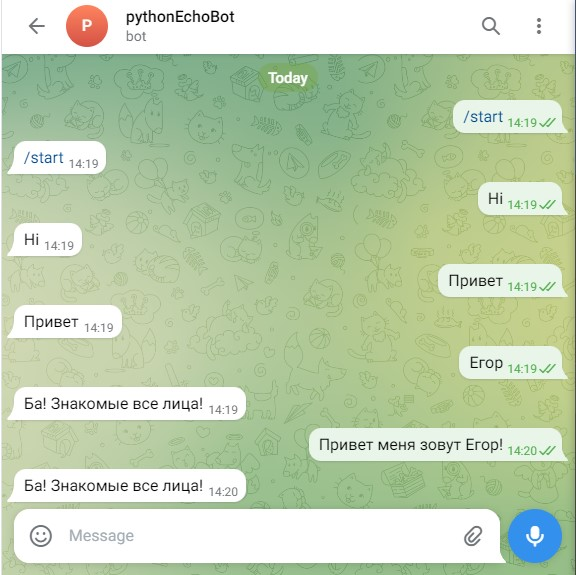

# Домашнее задание к занятию 4. Создаем первого Telegram-бота

## Задание 1
Модифицируйте нашего ЭхоБота таким образом, чтобы в ответ на сообщение, в котором присутствует ваше имя, он не повторял его, а отвечал: "Ба! Знакомые все лица!"

### Подсказки
1. Вам не нужно писать новых функций, достаточно модифицировать ту, что мы написали на занятии.
2. Используйте конструкцию `if word in string` для того, чтобы проверить, входит ли слово `word` в строку `string`.

### Ответ:
Дописал такой код, [файл бота](../Homeworks_py/04/Task04.py) прилагаю:
```python
import telebot

token = "<TOKEN_HERE>"

bot = telebot.TeleBot(token)
name = "Егор"


@bot.message_handler(content_types=["text"])
def echo(message):
    if name in message.text:
        bot.send_message(message.chat.id, "Ба! Знакомые все лица!")
    else:
        bot.send_message(message.chat.id, message.text)


bot.polling(none_stop=True)
```  
Также протестировал код, при вводе имени, либо предложения содержащее имя, получаем нужный ответ:


