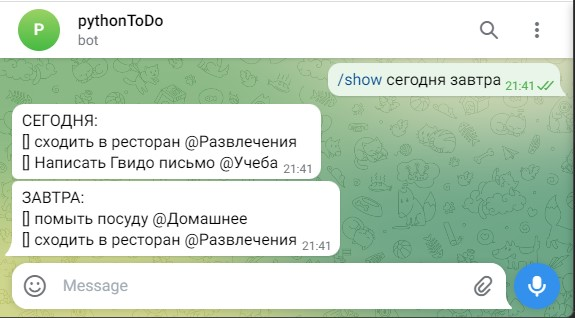

# Домашнее задание к занятию 5. Превращаем программу ToDo в бота

## Задание 1
Расширьте функциональность бота возможностью на ваш выбор.  
Примеры дополнительных возможностей: 
* Выводить ошибку при добавлении задачи, в которой меньше 3х символов.
* Печатать задачи на несколько дат: принимать в команде `print` не одну дату, а произвольное количество.
* При добавлении задачи учитывать отдельным параметром ее категорию. При выводе печатать категории задач со знаком @: Помыть посуду @Домашние дела.

### Ответ:
Задание выполнил, [файл бота с новыми функциями прилагаю](../Homeworks_py/05/Task05.py).  
При вводе команды `/show` получаем нужный результат:  

